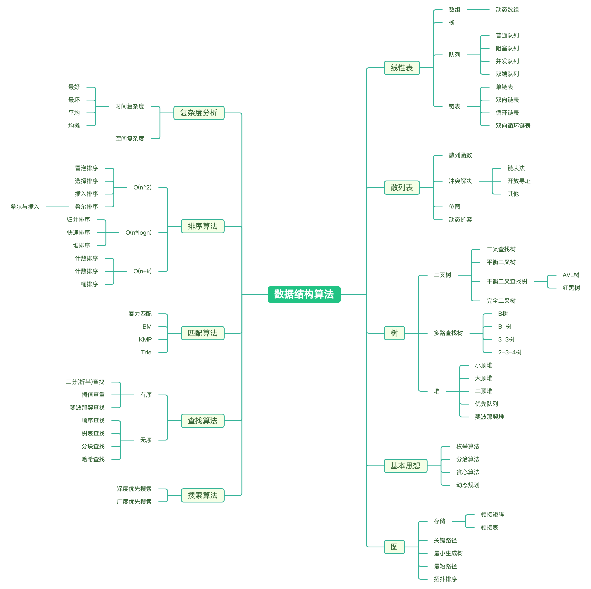

# 🌟 数据结构算法入门：轻松搞定
在编程的宇宙中，数据结构是你的工具库，而算法则是使用这些工具的说明书。就像修理家电需要选择合适的螺丝刀一样，处理数据时也需要：

- 🛠️ 精准选择：不同的数据结构就像各类工具，数组适合快速查找，链表适合频繁插入和删除，各有其独特的适用场景。
- 📚 熟练运用：算法如同使用工具的技巧，正确的排序算法和搜索算法能够显著提高程序的效率，影响最终的性能。
- 🧠 组合创新：优秀的开发者就像经验丰富的工匠，能够巧妙地搭配不同的数据结构和算法，创造出高效、优雅的解决方案。

通过理解数据结构与算法的关系，你将能够在编程世界中游刃有余，轻松应对各种挑战！

为了帮助你更好地理解这一切，接下来我们将展示一张思维导图，让你对整个数据结构和算法体系有一个全方位的了解：  

这张思维导图将为你揭示各个概念之间的关系，为接下来的学习打下坚实的基础。

## 🗄️ 什么是数据结构？
数据结构是计算机中存放和管理数据的方式。可以将其比作你衣柜里的衣物或书包里的书籍：

- 数据：就像衣柜里的衣服，是需要存储的信息。
- 结构：是整理这些衣物的方式，比如挂起来、叠放，或按类别排列。

常见的数据结构可以分为两类：

- 线性结构：如同一排整齐的衣物，适合顺序存储。常见的有数组、栈、队列和链表。📏
- 非线性结构：像书架上的书籍，适合表示更复杂的关系，如层次结构或网络关系。常见的有树、图、堆和哈希表。🌳

数据结构的作用是让计算机更快、更好地找到数据，正如一个整理得当的衣柜能让你迅速找到想穿的衣服。

## 📚 为什么要学习数据结构？
学习数据结构的理由就像选择好工具一样重要：

- 提升编程能力：掌握数据结构能让你写出更高效、易于维护的代码，就像用对了工具，工作事半功倍。🛠️
- 解决问题：很多实际问题的解决方案都依赖于适当的数据结构，类似于用锤子钉钉子、用螺丝刀拧螺丝。🔨
- 优化性能：选择合适的数据结构可以让你的程序跑得飞快，尤其是在处理大量数据时，就像赛车用的轻量级材料一样。🏎️  

通过学习数据结构，你将能够构建出更高效、灵活的软件解决方案，提升自己的技术能力！

## 🔗 数据结构与算法的关系

在编程中，数据结构和算法是密不可分的。可以把它们看作：
- 数据结构 = 工具箱（提供不同的数据组织方式）
- 算法 = 工具的使用方式（教你如何在工具箱里找到需要的工具）

## 📖 什么是算法？

算法是解决问题的一系列步骤或规则。它告诉你如何利用数据结构来完成特定的任务。比如：

- **查找**：在数据中找某个值。🔍
- **插入**：添加新数据。➕
- **删除**：移除不需要的数据。🗑️
- **排序**：让数据按某种顺序排列。📊
- **遍历**：逐个访问数据。👣

不同的数据结构适合不同的算法：

- **数组**：查找快，但插入和删除比较慢。⚡
- **链表**：适合频繁增删，但查找比较慢。🔗
- **哈希表**：查找快，但不适合范围查询。📋

## 📝 总结

| 概念       | 解释                        | 例子             |
|------------|-----------------------------|------------------|
| 数据结构   | 数据的组织方式             | 数组、链表、树、图 |
| 逻辑结构   | 数据之间的关系             | 线性（排队）、树形（家谱） |
| 存储结构   | 数据在计算机中的存放方式   | 顺序存储（数组）   |
| 算法       | 操作数据的方法             | 查找、排序、插入、删除 |

### 简单记忆：

- **逻辑结构** = 数据之间的关系。
- **存储结构** = 数据在计算机里的存放方式。
- **算法** = 操作这些数据的方法。

理解数据结构和算法，就像学会使用一把万能钥匙，让你能轻松打开编程世界的大门！🔑赶快行动起来，加入这场数据处理的冒险吧！🌟